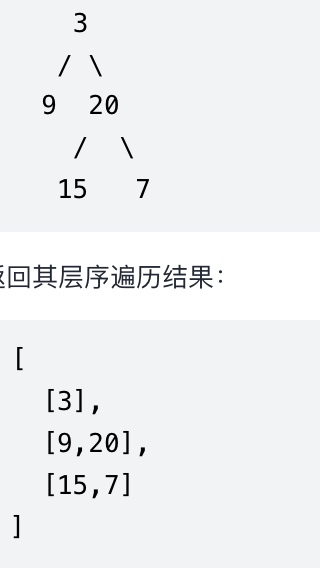
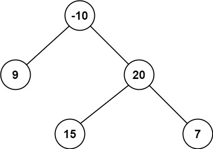

# binary_tree_related
## 总结

## 算法题
###  120.二叉树的层序遍历
给你一个二叉树，请你返回其按 层序遍历 得到的节点值。 （即逐层地，从左到右访问所有节点）。

示例：
二叉树：[3,9,20,null,null,15,7]



"""
BFS 算法，能够得到的结果是：3, 9, 20, 15, 7
我们期望的结果是:[[3],[9, 20], [15, 7]]
如果我们知道当前处理的具体是哪一层，就容易得到结果了
方法1: 记录每个元素所属层，可以通过元组的方式记录，也可以用另一个队列记录高度
    [(3, 0)]   => [[3]]
    [(9, 1), (20, 1)] ->[[3], [9, 20]]
    [(15, 2), (7, 2)] -> [[3], [9, 20], [15, 7]]
方法2: 找规律，因为是逐层处理，所以我们可以不用记录第几层，主要逐层处理所有元素，然后把当前层的结果保存就可以了
例如：第0层：队列 [3]      结果集：[[3]]
     第1层：队列 [9, 20]  结果集：[[3], [9, 20]]
     第二层：队列 [15, 7] 结果集：[[3], [9, 20], [15, 7]]
"""
```
# Definition for a binary tree node.
# class TreeNode:
#     def __init__(self, val=0, left=None, right=None):
#         self.val = val
#         self.left = left
#         self.right = right

class Solution:
    def levelOrder(self, root: TreeNode) -> List[List[int]]:
        if not root:
             return []
        queue = deque([(root, 0)])
        ans = []
        while queue:
            node, depth = queue.popleft()
            if depth >= len(ans):
                ans.append([node.val])
            else:
                ans[depth].append(node.val)
            if node.left:
                queue.append((node.left, depth + 1))
            if node.right:
                queue.append((node.right, depth + 1))
        return ans


    def levelOrder(self, root: TreeNode) -> List[List[int]]:
        if not root:
             return []
        queue = deque([root])
        ans = []
        while queue:
            length = len(queue)
            cur_floor = []
            for i in range(length):
                top = queue.popleft()
                cur_floor.append(top.val)
                if top.left:
                    queue.append(top.left)
                if top.right:
                    queue.append(top.right)
            ans.append(cur_floor)
        return ans
```
"""
DFS 算法，先序遍历-能够得到的结果是：3, 9, 20, 15, 7
可以在遍历的过程中记录深度，得到的结果是[(3, 0), (9, 1), (20, 1), (15, 1), (7, 1)], 然后再一次遍历，生成结果集
"""
```
class Solution:
    def levelOrder(self, root: TreeNode) -> List[List[int]]:
        ans = []
        def dfs(root: TreeNode, depth: int) -> NoReturn:
            if root is None: return
            ans.append((root.val, depth))
            dfs(root.left, depth + 1)
            dfs(root.right, depth + 1)
        dfs(root, 0)
        res = []
        for val, depth in ans:
            if depth >= len(res):
                res.append([val])
            else:
                res[depth].append(val)
        return res
```
可以避免第二次的遍历吗？
可以在递归的过程中填充结果集
例如：套用先序遍历的模版
```
if root is None: return
# do something
dfs(root.left)
dfs(root.right)
我们可以在 ‘do something’中 完成逻辑
if len(ans) <= depth:
    ans.append([root.val])
else:
    ans[depth].append(root.val)
```
"""
```
class Solution:
    def levelOrder(self, root: TreeNode) -> List[List[int]]:
        ans = []
        def dfs(root: TreeNode, depth: int) -> NoReturn:
            if root is None: return
            if depth >= len(ans):
                ans.append([root.val])
            else:
                ans[depth].append(root.val)
            dfs(root.left, depth + 1)
            dfs(root.right, depth + 1)
        dfs(root, 0)
        return ans
```
### 124. Binary Tree Maximum Path Sum
> A path in a binary tree is a sequence of nodes where each pair of adjacent nodes in the sequence has an edge connecting them. A node can only appear in the sequence at most once. Note that the path does not need to pass through the root.

>The path sum of a path is the sum of the node's values in the path.

>Given the root of a binary tree, return the maximum path sum of any non-empty path.
>
>Input: root = [-10,9,20,null,null,15,7]
>Output: 42
>Explanation: The optimal path is 15 -> 20 -> 7 with a path sum of 15 + 20 + 7 = 42.

#### 解题思路
假设我们有以下定义：
- 节点root的左子树的最大路径和为m_l
- 节点root的左子树中包含左子节点的最大路径和为p_l
- 节点root的右子树的最大路径和为m_r
- 节点root的右子树中包含右子节点的最大路径和为p_r
- 节点root这个树的最大路径和为m_cur
- 以root为根构成的树，包含root的最大路径和为p_cur
那么：
    p_cur = max(p_l + root.val, p_r + root.val, root.val)
    m_cur = max(m_l, m_r, p_l + root.val + p_r, p_cur)
     
节点root的p_cur和m_cur 都可以通过左子树和右子树推导得来，所以，可以通过DFS算法实现。
定义一个函数dfs(root)，求左子树 root.left 最大值 m_l， 路径最大值 p_l
求右子树 root.right 最大值 m_r  路径最大值 p_r
退出的条件：空节点： return 0, 0 会存在问题，因为值允许为负数，所以可以返回最小值，python中最小值：-sys.maxsize - 1
#### 复杂度
- 时间复杂度：O(n)
- 空间复杂度：O(h)    
#### Python 代码
```
class Solution:
    MIN_V = -sys.maxsize - 1
    def maxPathSum(self, root: TreeNode) -> int:
        if root is None: return 0
        m_r, _ = self.dfs(root)
        return m_r

    
    def dfs(self, root: TreeNode) -> (int, int):
        if root is None: 
            return self.MIN_V, self.MIN_V
 
        m_l, p_l = self.dfs(root.left)
        m_r, p_r = self.dfs(root.right)
        p_cur = max(p_r + root.val, p_l + root.val, root.val)
        m_cur = max(m_l, m_r, p_l + p_r + root.val, p_cur)
        
        return m_cur, p_cur
```

#### Golang 代码
```
 type TreeNode struct {
     Val int
     Left *TreeNode
     Right *TreeNode
 }
 
func maxPathSum(root *TreeNode) int {
    maxSum := math.MinInt32
    var maxGain func(*TreeNode) int
    maxGain = func(node *TreeNode ) int{
        if node == nil {
            return 0
        }
        leftGain := max(maxGain(node.Left), 0)
        rightGain := max(maxGain(node.Right), 0)
        maxSum = max(leftGain + rightGain + node.Val, maxSum)
        return node.Val + max(leftGain, rightGain)
    }
    maxGain(root)
    return maxSum
}
func max(x, y int) int {
    if (x > y) {
        return x
    }
    return y
}
```

#### c++ 代码
```
class Solution {
public:
    int maxVal = INT_MIN;
    int maxPathSum(TreeNode* root) {
        dfs(root);
        return maxVal;
    }

    int dfs(TreeNode* root) {
        if (root == nullptr) {
            return 0;
        }
        int left = max(0, dfs(root->left));
        int right = max(0, dfs(root->right));
        maxVal = max(left + right + root->val, maxVal);
        return root->val + max(left, right);
    }
    
};
```