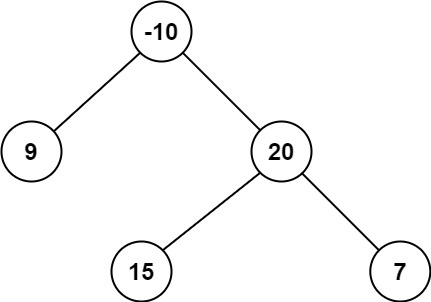
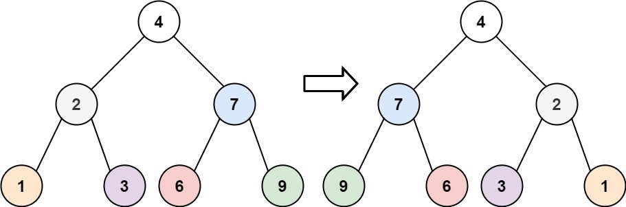
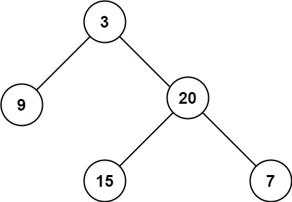
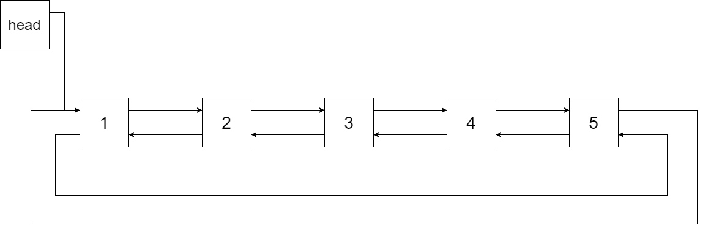
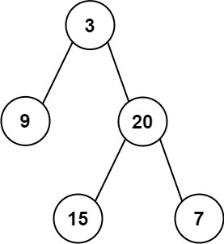

# binary_tree_related
## 总结

## 算法题
###  120.二叉树的层序遍历
给你一个二叉树，请你返回其按层序遍历得到的节点值。 （即逐层地，从左到右访问所有节点）。

示例：
二叉树：[3,9,20,null,null,15,7]


"""
BFS 算法，能够得到的结果是：3, 9, 20, 15, 7
我们期望的结果是:[[3],[9, 20], [15, 7]]
如果我们知道当前处理的具体是哪一层，就容易得到结果了
方法1: 记录每个元素所属层，可以通过元组的方式记录，也可以用另一个队列记录高度
    [(3, 0)]   => [[3]]
    [(9, 1), (20, 1)] ->[[3], [9, 20]]
    [(15, 2), (7, 2)] -> [[3], [9, 20], [15, 7]]
方法2: 找规律，因为是逐层处理，所以我们可以不用记录第几层，主要逐层处理所有元素，然后把当前层的结果保存就可以了
例如：第0层：队列 [3]      结果集：[[3]]
     第1层：队列 [9, 20]  结果集：[[3], [9, 20]]
     第二层：队列 [15, 7] 结果集：[[3], [9, 20], [15, 7]]
"""
```
# Definition for a binary tree node.
# class TreeNode:
#     def __init__(self, val=0, left=None, right=None):
#         self.val = val
#         self.left = left
#         self.right = right

class Solution:
    def levelOrder(self, root: TreeNode) -> List[List[int]]:
        if not root:
             return []
        queue = deque([(root, 0)])
        ans = []
        while queue:
            node, depth = queue.popleft()
            if depth >= len(ans):
                ans.append([node.val])
            else:
                ans[depth].append(node.val)
            if node.left:
                queue.append((node.left, depth + 1))
            if node.right:
                queue.append((node.right, depth + 1))
        return ans


    def levelOrder(self, root: TreeNode) -> List[List[int]]:
        if not root:
             return []
        queue = deque([root])
        ans = []
        while queue:
            length = len(queue)
            cur_floor = []
            for i in range(length):
                top = queue.popleft()
                cur_floor.append(top.val)
                if top.left:
                    queue.append(top.left)
                if top.right:
                    queue.append(top.right)
            ans.append(cur_floor)
        return ans
```
"""
DFS 算法，先序遍历-能够得到的结果是：3, 9, 20, 15, 7
可以在遍历的过程中记录深度，得到的结果是[(3, 0), (9, 1), (20, 1), (15, 1), (7, 1)], 然后再一次遍历，生成结果集
"""
```
class Solution:
    def levelOrder(self, root: TreeNode) -> List[List[int]]:
        ans = []
        def dfs(root: TreeNode, depth: int) -> NoReturn:
            if root is None: return
            ans.append((root.val, depth))
            dfs(root.left, depth + 1)
            dfs(root.right, depth + 1)
        dfs(root, 0)
        res = []
        for val, depth in ans:
            if depth >= len(res):
                res.append([val])
            else:
                res[depth].append(val)
        return res
```
可以避免第二次的遍历吗？
可以在递归的过程中填充结果集
例如：套用先序遍历的模版
```
if root is None: return
# do something
dfs(root.left)
dfs(root.right)
我们可以在 ‘do something’中 完成逻辑
if len(ans) <= depth:
    ans.append([root.val])
else:
    ans[depth].append(root.val)
```
"""
```
class Solution:
    def levelOrder(self, root: TreeNode) -> List[List[int]]:
        ans = []
        def dfs(root: TreeNode, depth: int) -> NoReturn:
            if root is None: return
            if depth >= len(ans):
                ans.append([root.val])
            else:
                ans[depth].append(root.val)
            dfs(root.left, depth + 1)
            dfs(root.right, depth + 1)
        dfs(root, 0)
        return ans
```
### 124. Binary Tree Maximum Path Sum
> A path in a binary tree is a sequence of nodes where each pair of adjacent nodes in the sequence has an edge connecting them. A node can only appear in the sequence at most once. Note that the path does not need to pass through the root.

>The path sum of a path is the sum of the node's values in the path.

>Given the root of a binary tree, return the maximum path sum of any non-empty path.
>
>Input: root = [-10,9,20,null,null,15,7]
>Output: 42
>Explanation: The optimal path is 15 -> 20 -> 7 with a path sum of 15 + 20 + 7 = 42.

#### 解题思路
假设我们有以下定义：
- 节点root的左子树的最大路径和为m_l
- 节点root的左子树中包含左子节点的最大路径和为p_l
- 节点root的右子树的最大路径和为m_r
- 节点root的右子树中包含右子节点的最大路径和为p_r
- 节点root这个树的最大路径和为m_cur
- 以root为根构成的树，包含root的最大路径和为p_cur
那么：
    p_cur = max(p_l + root.val, p_r + root.val, root.val)
    m_cur = max(m_l, m_r, p_l + root.val + p_r, p_cur)
     
节点root的p_cur和m_cur 都可以通过左子树和右子树推导得来，所以，可以通过DFS算法实现。
定义一个函数dfs(root)，求左子树 root.left 最大值 m_l， 路径最大值 p_l
求右子树 root.right 最大值 m_r  路径最大值 p_r
退出的条件：空节点： return 0, 0 会存在问题，因为值允许为负数，所以可以返回最小值，python中最小值：-sys.maxsize - 1
#### 复杂度
- 时间复杂度：O(n)
- 空间复杂度：O(h)    
#### Python 代码
```
class Solution:
    MIN_V = -sys.maxsize - 1
    def maxPathSum(self, root: TreeNode) -> int:
        if root is None: return 0
        m_r, _ = self.dfs(root)
        return m_r

    
    def dfs(self, root: TreeNode) -> (int, int):
        if root is None: 
            return self.MIN_V, self.MIN_V
 
        m_l, p_l = self.dfs(root.left)
        m_r, p_r = self.dfs(root.right)
        p_cur = max(p_r + root.val, p_l + root.val, root.val)
        m_cur = max(m_l, m_r, p_l + p_r + root.val, p_cur)
        
        return m_cur, p_cur
```

#### Golang 代码
```
 type TreeNode struct {
     Val int
     Left *TreeNode
     Right *TreeNode
 }
 
func maxPathSum(root *TreeNode) int {
    maxSum := math.MinInt32
    var maxGain func(*TreeNode) int
    maxGain = func(node *TreeNode ) int{
        if node == nil {
            return 0
        }
        leftGain := max(maxGain(node.Left), 0)
        rightGain := max(maxGain(node.Right), 0)
        maxSum = max(leftGain + rightGain + node.Val, maxSum)
        return node.Val + max(leftGain, rightGain)
    }
    maxGain(root)
    return maxSum
}
func max(x, y int) int {
    if (x > y) {
        return x
    }
    return y
}
```

#### c++ 代码
```
class Solution {
public:
    int maxVal = INT_MIN;
    int maxPathSum(TreeNode* root) {
        dfs(root);
        return maxVal;
    }

    int dfs(TreeNode* root) {
        if (root == nullptr) {
            return 0;
        }
        int left = max(0, dfs(root->left));
        int right = max(0, dfs(root->right));
        maxVal = max(left + right + root->val, maxVal);
        return root->val + max(left, right);
    }
};
```

### 126  Invert Binary Tree
> Given the root of a binary tree, invert the tree, and return its root.
> 
> Input: root = [4,2,7,1,3,6,9]
> Output: [4,7,2,9,6,3,1]

#### 解题思路
方法1: 递归
以题中的例子来说明，如果7 和 2这两颗子树都已经翻转完成，那么对于他们的父节点4来讲，只需要执行：
    `root.left, root.right = root.right, root.left`
符合大问题化解成小问题的规律，非常适合用递归来实现。
退出条件：节点为空的时候，返回空。
时间复杂度：O(n)
空间复杂度：O(h)

方法2: 迭代解法
逐层进行交换，还是以题中的例子来说明，对于4来讲，我现将4的两个节点进行交换，例如，4 2 7 -> 4 7 2 
下一个要处理的节点为7: 7  6  9 -> 7  9  6
下一个要处理的节点为2: 2  1  3 -> 2  3  1
叶子结点不需要处理，所以处理结束
时间复杂度：O(n)
空间复杂度：O(n)

#### python 代码
```
# Definition for a binary tree node.
# class TreeNode:
#     def __init__(self, val=0, left=None, right=None):
#         self.val = val
#         self.left = left
#         self.right = right

class Solution: 
    # 方法1 
    def invertTree(self, root: TreeNode) -> TreeNode:
        if root is None: return root
        left = self.invertTree(root.left)
        right = self.invertTree(root.right)
        root.left, root.right = root.right, root.left
        return root
    # 方法2
    def invertTree(self, root: TreeNode) -> TreeNode:
        if root is None: return root
        queue = deque([root])
        while queue:
            top = queue.popleft()
            top.left, top.right = top.right, top.left
            
            if top.left and (top.left.left or top.left.right):
                queue.append(top.left)

            if top.right and (top.right.left or top.right.right):
                queue.append(top.right)
        return root
```
#### golang 代码

#### c++ 代码
```
/**
 * Definition for a binary tree node.
 * struct TreeNode {
 *     int val;
 *     TreeNode *left;
 *     TreeNode *right;
 *     TreeNode() : val(0), left(nullptr), right(nullptr) {}
 *     TreeNode(int x) : val(x), left(nullptr), right(nullptr) {}
 *     TreeNode(int x, TreeNode *left, TreeNode *right) : val(x), left(left), right(right) {}
 * };
 */
 // 方法1
class Solution {
public:
    TreeNode* invertTree(TreeNode* root) {
        if (root == nullptr) {
            return root;
        }
        TreeNode* left = invertTree(root->left);
        TreeNode* right = invertTree(root->right);
        TreeNode* tmp = root->left;
        root->left = right;
        root->right = tmp;
        return root;
    }
};

// 方法2
class Solution {
public:
    TreeNode* invertTree(TreeNode* root) {
        if (root == nullptr) {
            return root;
        }
        std::queue<TreeNode*> cur_queue({root});
        
        while (!cur_queue.empty()) {
            TreeNode * top = cur_queue.front();
            cur_queue.pop();
            TreeNode* tmp = top->left;
            top->left = top->right;
            top->right = tmp;
            if (top->left != nullptr && (top->left->left != nullptr or top->left->right != nullptr)) {
                cur_queue.push(top->left);
            }
            if (top->right != nullptr && (top->right->left != nullptr or top->right->right != nullptr)) {
                cur_queue.push(top->right);
            }
        }
        return root;
    }
};
```

### 104. Maximum Depth of Binary Tree
Given the root of a binary tree, return its maximum depth.

A binary tree's maximum depth is the number of nodes along the longest path from the root node down to the farthest leaf node.


#### 解题思路
方法1: 利用DFS算法。
最大的深度和最大的高度是一致的，可以利用最大高度求解。
假设节点node的高度为h，node的左子节点的高度为h_l, node的右子节点的高度为h_r, 那么有 
`h = max(h_l + h_r) + 1`
这样，就可以将求节点node 的高度转化为求解node的左子节点和右子节点的高度。
时间复杂度：O(n)
空间复杂度：O(h)
方法2: 利用BFS算法
这个思路和逐层输出、按照锯齿形排序的思想是一致的，而且可以用一个模版。
模板：
```
if root is None: return sth

queue = deque([root])
    while queue:
        size = len(queue)
        for i in range(size):
            top = queue.popleft()
            # do sth
            if top.left:
                queue.append(top.left)
            if top.right:
                queue.append(top.right)
        # do sth
    return sth
```
时间复杂度：O(n)
空间复杂度：O(h)

#### python 代码
```
class TreeNode:
    def __init__(self, val=0, left=None, right=None):
        self.val = val
        self.left = left
        self.right = right
class Solution:
    def maxDepth(self, root: Optional[TreeNode]) -> int:
        if root is None:
            return 0
        left = self.maxDepth(root.left)
        right = self.maxDepth(root.right)
        return max(left, right) + 1
    
    def maxDepth(self, root: Optional[TreeNode]) -> int:
        if root is None: return 0
        ans = 0
        queue = deque([root])
        while queue:
            size = len(queue)
            for i in range(size):
                top = queue.popleft()
                if top.left:
                    queue.append(top.left)
                if top.right:
                    queue.append(top.right)
            ans += 1
        return ans
```
#### c++ 代码
```
/**
 * Definition for a binary tree node.
 * struct TreeNode {
 *     int val;
 *     TreeNode *left;
 *     TreeNode *right;
 *     TreeNode() : val(0), left(nullptr), right(nullptr) {}
 *     TreeNode(int x) : val(x), left(nullptr), right(nullptr) {}
 *     TreeNode(int x, TreeNode *left, TreeNode *right) : val(x), left(left), right(right) {}
 * };
 */
class Solution {
public:
    int maxDepth(TreeNode* root) {
        if (root == nullptr) {
            return 0;
        }
        int left = maxDepth(root->left);
        int right = maxDepth(root->right);
        return max(left, right) + 1;
    }
    
};
```
### 剑指 Offer 26. 树的子结构
输入两棵二叉树A和B，判断B是不是A的子结构。(约定空树不是任意一个树的子结构)

B是A的子结构， 即 A中有出现和B相同的结构和节点值。

#### 解题思路
如果树B是A的子结构，那么树B的根节点可能是树A的任意节点。 因此，本质上还是遍历，因此这里包括两个步骤：
1. 遍历A的所有节点.
2. 对于任意一个遍历到的节点Ai, 判断B树是否是Ai的子树。
所以，如果都用递归的话，这里有两个递归的地方。第一步可以使用递归，第二步也可以使用递归。
当然，第一步也可以不使用递归，遍历的多种方式都可以用。
#### 代码
##### 实现方式1
```
class Solution:
    def isSubStructure(self, A: TreeNode, B: TreeNode) -> bool:
        return self.dfs(A, B) or self.isSubStructure(A.left, B) or self.isSubStructure(A.right, B)
    
    def dfs(self, A: TreeNode, B: TreeNode) -> bool:
        if B is None: 
            return True
        if A is None:
            return False
        if A.val != B.val: return False
        return self.dfs(A.left, B.left) and self.dfs(A.right, B.right)
```
##### 实现方式2
```
class Solution:
    
    def isSubStructure(self, A: TreeNode, B: TreeNode) -> bool:
        if A is None or B is None: return False
        stack = []
        root = A
        while stack or root:
            if root:
                if self.dfs(root, B):
                    return True
                stack.append(root)
                root = root.left
            else:
                top = stack.pop()
                root = top.right
        
        return False
    
    def dfs(self, A: TreeNode, B: TreeNode) -> bool:
        if B is None: 
            return True
        if A is None:
            return False
        if A.val != B.val: return False
        return self.dfs(A.left, B.left) and self.dfs(A.right, B.right)
```
### 426 将二叉搜索树转化为排序的双向链表
将一个 二叉搜索树 就地转化为一个 已排序的双向循环链表 。

对于双向循环列表，你可以将左右孩子指针作为双向循环链表的前驱和后继指针，第一个节点的前驱是最后一个节点，最后一个节点的后继是第一个节点。

**特别地，我们希望可以 就地 完成转换操作。当转化完成以后，树中节点的左指针需要指向前驱，树中节点的右指针需要指向后继。还需要返回链表中最小元素的指针。**
例如： root = [4,2,5,1,3] 

输出：[1,2,3,4,5]

#### 解题思路
二叉搜索树的一个很重要的特征：二叉搜索树的中序遍历 是有序的。
总的来说，需要明白这个题就是一个遍历的变形题。
##### 方法1 两次遍历
一种很直观的解决方法是两次遍历。
step1: 对这颗二叉搜索树进行中序遍历，输出一个数组.
step2: 遍历有序数组，生双向链表。

代码如下：
```
class Solution:
    def treeToDoublyList(self, root: 'Node') -> 'Node':
        if root is None: return
        array = []
        def dfs(root: 'Node') -> 'Node':
            if root is None: return
            dfs(root.left)
            array.append(root)
            dfs(root.right)
        dfs(root)
        for i in range(1, len(array)):
            array[i].left = array[i-1]
            array[i-1].right = array[i]
        array[0].left = array[-1]
        array[-1].right = array[0]
        return array[0]
```
##### 方法2 一次遍历
可以注意到，其实在中序遍历的过程中，当前节点只关心上一个节点。只需要记录上一个节点。
但是也有例外，因为是循环双向链表，所以，还要处理最小节点和最大节点。
```
class Solution:
    def __init__(self):
        self.last_node = None
        self.start_node = None

    def treeToDoublyList(self, root: 'Node') -> 'Node':
        if root is None: return
        self.dfs(root)
        self.start_node.left = self.last_node
        self.last_node.right = self.start_node
        return self.start_node
    
    def dfs(self, root: 'Node') -> 'Node':
        if root is None: return
        self.dfs(root.left)
        if self.last_node:
            self.last_node.right, root.left =root, self.last_node
        else:
            self.start_node = root
        
        self.last_node = root
        self.dfs(root.right)
```
### 105. 从前序与中序遍历序列构造二叉树
给定一棵树的前序遍历 preorder 与中序遍历  inorder。请构造二叉树并返回其根节点。
示例 1:

Input: preorder = [3,9,20,15,7], inorder = [9,3,15,20,7]
Output: [3,9,20,null,null,15,7]
**解题思路**
关键是能够识别中序遍历的特征。
- 中序遍历root节点左边的所有数据都是其左子树的中序遍历结果。
- 中序遍历root节点右边的所有数据都是其右子树的中序遍历结果。
- 先序遍历的第一个节点是根节点。

根据上述的特征，我们可以把构造二叉分解成构造root节点左子树和右子树。
以[3,9,20,15,7]      [9,3,15,20,7]
分解成：左子树： [9] [9] 
       右子树：[20,15, 7]  [15, 20, 7]
继续递归分解，可以完成子树的构造。
解题步骤：
step1: 确认root 节点。
step2: 计算在inorder中的index.
step3: 计算左子树的元素个数
step4: 确认左子树的preorder 和 inorder
step5: 确认右子树的preorder 和 inorder
step6: 递归构造左子树和右子树
step7: from step1

**代码**
```
class Solution:
    def buildTree(self, preorder: List[int], inorder: List[int]) -> TreeNode:
        if len(preorder) <= 1:
            return TreeNode(preorder[0])
        index_map = {node: i for i, node in enumerate(inorder)}
        
        def helper(pre_s: int, pre_e: int, in_s: int, in_e: int) -> TreeNode:
            if pre_s > pre_e or in_s > in_e:
                return None
        
            if pre_s == pre_e:
                return TreeNode(preorder[pre_s])
            
            node = TreeNode(preorder[pre_s])
            r_i = index_map[node.val]
            pre_len = r_i - in_s
            cur_pre_end = pre_s + pre_len
            node.left = helper(pre_s + 1, cur_pre_end, in_s, r_i - 1)
            node.right = helper(cur_pre_end + 1, pre_e, r_i + 1, in_e)
            return node
        return helper(0, len(preorder)- 1, 0, len(inorder) - 1)
```     

### 106 
### 96 